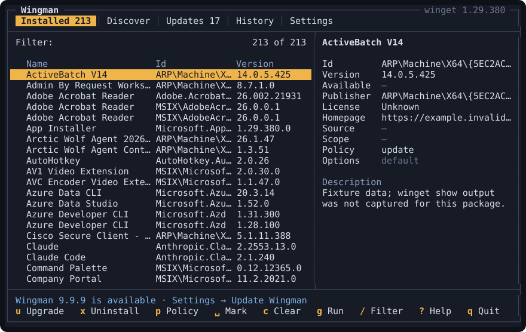
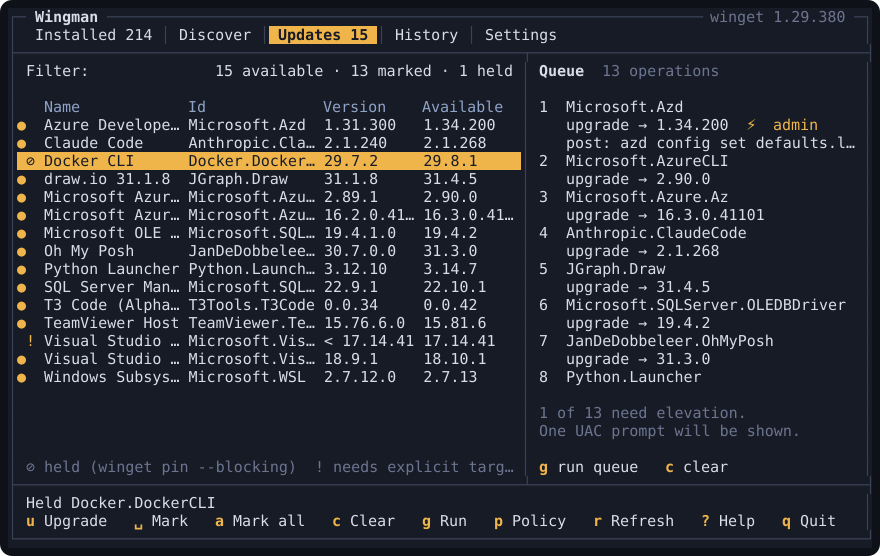
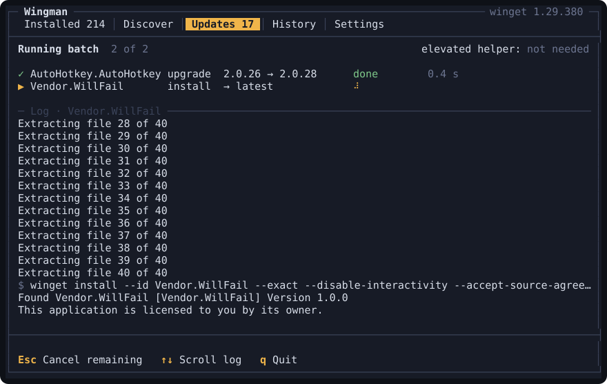
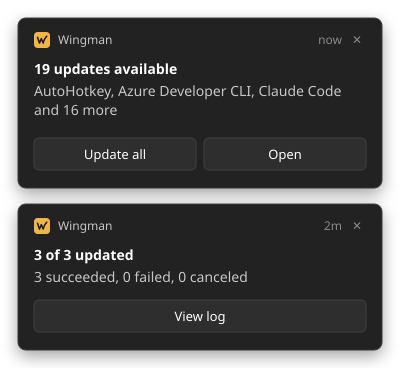

<p align="center"></p>

<h1 align="center">Wingman</h1>

<p align="center">A keyboard-driven terminal UI for winget, with a headless CLI for scripts.</p>

<p align="center">
  <a href="https://github.com/BenBurge/Wingman/actions/workflows/ci.yml"></a>
  <a href="https://github.com/BenBurge/Wingman/releases"></a>
  <a href="LICENSE"></a>
  
  
  <a href="manifests"></a>
</p>

Wingman is for people who live in a terminal and want the Windows Package Manager
without its rough edges. It puts `winget` behind a fast, mouse-friendly terminal UI:
browse and search packages, mark a batch and run it behind a single elevation prompt,
hold or skip updates per package, remember install options, and let scheduled checks,
toasts, and a tray icon keep you current in the background. Bundles are read and
written in UniGetUI's `.ubundle` format, so the two tools share package lists and
options.

## Screenshots


*The Installed tab, with the selected package's details on the right.*


*The Updates tab with packages marked into a queue, showing which need elevation.*


*A running batch, with each operation's winget output streaming into the log.*

## Features

**Browse and search**
- Installed, Discover, Updates, History, and Settings tabs; each list has a live filter, sortable columns, and a details pane.
- Held and excluded packages stay visible with a marker; the Updates tab title carries the available count.
- Every action has a key and is also reachable by click, double-click, wheel, or the right-click context menu.
- Four themes, plus Auto to follow the system's light or dark mode.

**Batches and elevation**
- Mark packages across tabs into a queue, then install, upgrade, and uninstall them in one run.
- One UAC or Admin By Request prompt per batch: an elevated helper runs every operation that needs administrator rights, and declining the prompt skips only those.
- A failed operation shows a plain-language cause and offers retry, retry interactive, retry skipping the hash check, and retry elevated.
- Elevation modes (Auto, Always, Never) and a choice of launcher, `wingman.exe` or Windows PowerShell, for admin-approval tools that only whitelist PowerShell.

**Policies and options**
- Hold a package at its current version (a blocking `winget pin`) or skip one version.
- Exclude apps that update themselves, such as Discord or Chrome, from the Updates tab, auto-install, and toasts.
- Per-package install options: scope, architecture, version, install location, interactive, skip hash, custom arguments, run as administrator, and pre/post commands, stored in UniGetUI's `InstallOptions` schema.

**Bundles**
- Export installed packages, with their options, to a UniGetUI `.ubundle`.
- Import one through a plan that shows what will be installed, upgraded, kept, or skipped; packages from other managers are listed and skipped.

**Automation**
- Scheduled update checks on an interval and at login, and optional daily auto-install.
- Toasts with actions (Update all, Open, View log) that replace each other instead of piling up.
- A tray icon whose badge shows updates available, work in progress, a failed run, or paused notifications.
- Self-update from GitHub Releases: an installed Wingman downloads, verifies, and installs new releases on its own (Settings → Keep Wingman up to date automatically), or on demand from the TUI or `wingman self-update`.

<p align="center"></p>
<p align="center"><em>Native Windows toasts: Update all opens Wingman with every update marked and ready to run; View log opens History.</em></p>

**Headless CLI**
- Check, list, search, upgrade, install, export, import, and history from scripts, with `--json` output, `--dry-run`, `--yes`, and stable exit codes.

## Install

Wingman runs on Windows 10 and 11 with winget 1.4 or newer. It ships as a single
self-contained executable, so no .NET runtime is needed.

**Installer:** download `wingman-v<version>-win-x64-setup.exe` (or `-win-arm64-setup.exe`)
from [Releases](https://github.com/BenBurge/Wingman/releases) and run it; no admin rights
needed. It installs to `%LOCALAPPDATA%\Programs\Wingman`, adds `wingman` to your PATH,
starts the tray icon and registers it at login, and sets up scheduled update checks.
Uninstall from Settings → Apps.

**winget** (once the manifest is published to the community repository) runs the same
installer:

```
winget install BenBurge.Wingman
```

**Portable zip:** download `wingman-v<version>-win-x64.zip` or `-win-arm64.zip` from
Releases, extract `wingman.exe` to a folder on your PATH, and run `wingman setup`.

**From source, for development:** `pwsh tools/Install-Local.ps1` publishes a
single-file build to `%LOCALAPPDATA%\Programs\Wingman`, adds it to PATH, and runs
`wingman setup`. `-Uninstall` reverses it, `-NoSetup` skips registration, and
`-Rid win-arm64`, `-Configuration Debug`, and `-DryRun` are also available.

## Quick start

Run `wingman` to open the terminal UI. Press `?` at any time for the keys of the
current tab.

| Key | Action | Key | Action |
|---|---|---|---|
| `1`-`5` | Installed, Discover, Updates, History, Settings | `p` | Update policy |
| `/` | Filter, or search on Discover | `o` | Install options |
| `Space` | Mark for the batch | `b` | Export or import a bundle |
| `g` | Run the queue | `c` | Clear the queue |
| `i` | Install (Discover) | `m` | Context menu |
| `u` | Upgrade | `?` | Help |
| `x` | Uninstall (Installed) | `q` | Quit |

`wingman setup`, which the installer runs for you, registers the scheduled update
checks, starts the tray icon at login, creates the Start Menu shortcut that toasts
need, and registers `wingman:` links so toast and tray actions can open the UI. It is
safe to rerun after changing settings. `wingman setup --remove` undoes all of it.

## Command line

`wingman` with no arguments opens the terminal UI; with a command it runs headlessly.
Every command takes `--fake`, which runs against captured winget output instead of a
real `winget.exe`, and `--json`, which prints exactly one JSON document to standard
output. See [Headless CLI](docs/DESIGN.md#headless-cli) for every option.

| Command | Description |
|---|---|
| `check [--notify]` | List available updates, record them for the tray, and optionally show a toast. |
| `list [query]` | List installed packages. |
| `search <query>` | Search winget, marking packages already installed. |
| `upgrade --all \| <id>...` | Upgrade packages, skipping held, excluded, and skipped versions with `--all`. |
| `install <id>...` | Install packages with their stored options, or move one to `--version`. |
| `export <file>` | Write installed packages to a UniGetUI bundle. |
| `import <file>` | Plan a bundle against what is installed, then run it. |
| `history` | List past operations; `history show <n>` prints one with its log. |
| `setup [--remove]` | Register or remove the scheduled tasks, tray startup, shortcut, and `wingman:` links. |
| `self-update [--check]` | Update Wingman through winget. |
| `tray` | Run the system tray icon. |
| `open [route]` | Open the terminal UI on a tab, such as `updates` or `history`. |

`upgrade`, `install`, and `import` show their plan and ask before running, unless
`--dry-run` or `--yes` is given.

| Exit code | Meaning |
|---|---|
| `0` | Success. |
| `1` | An operation failed, or the command hit an error. |
| `2` | Usage error, or a batch command refusing to run unattended without `--yes`. |
| `10` | Updates are available (`check`, `self-update --check`). |
| `130` | Canceled with Ctrl+C, or the plan was declined. |

## Configuration

Wingman keeps its state in `%APPDATA%\Wingman`. Set `WINGMAN_DATA_DIR` to use another
folder; the TUI and every command honor it.

| File | Holds |
|---|---|
| `settings.json` | Defaults, theme, elevation, schedule, and notification settings. The Settings tab edits it. |
| `package-options.json` | Per-package install options and update policies, in UniGetUI's schema. |
| `state.json` | The last check and batch results, which the tray reads. |
| `history/` | One `.json` and `.log` pair per operation, pruned to the last 1000. |

**Elevation mode** (`elevationMode`) picks which operations in a batch go through the
elevated helper. `auto`, the default, elevates those whose options or installer type
need administrator rights; `always` elevates every operation; `never` starts no helper
and lets winget and each installer prompt on their own.

**Elevation launcher** (`elevationLauncher`) picks what the prompt starts. `direct`, the
default, elevates `wingman.exe` itself. `powerShell` elevates Windows PowerShell, which
then starts Wingman; pick it when an admin-approval tool such as Admin By Request
whitelists PowerShell but not Wingman.

## Development

```
dotnet build Wingman.sln
dotnet test Wingman.sln
dotnet run --project src/Wingman -- --fake
```

`--fake` drives the whole UI and every command from captured fixtures, so everything
except the Windows-only pieces runs on macOS and Linux too.

- `tools/TuiHarness` runs the TUI headless at a fixed size, scripts keys and mouse
  events, and dumps every frame to `out.txt`:
  `dotnet run --project tools/TuiHarness -- 96 30 Midnight`.
- `pwsh tools/Build-Installer.ps1 -Version 0.1.0` publishes and builds the setup
  executable into `artifacts/`; it needs Inno Setup 6
  (`winget install JRSoftware.InnoSetup`).
- Parser fixtures are captured on Windows with `tools/Capture-WingetFixtures.ps1` and
  live in `tests/Wingman.Core.Tests/Fixtures/`.
- Work follows the issue-per-PR workflow in [AGENTS.md](AGENTS.md).
- [docs/DESIGN.md](docs/DESIGN.md) holds the decisions and architecture, and
  [docs/mockups/wingman-screens.html](docs/mockups/wingman-screens.html) shows every
  screen, the toasts, the tray icon, and the themes.

## License

MIT. See [LICENSE](LICENSE).
